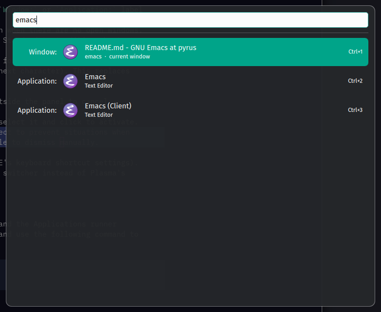

# Search Window Switcher

Window switcher and application launcher for KWin with support for incremental search.



## Behaviour

- Windows are ordered by MRU, with the window that was active when the switcher opened appended at the end (same behaviour as the default Alt-Tab window switcher).
- **Enable application launcher**, the first effect setting, is on by default. If it's turned off, the effect works as a window switcher.
- When you type a query, matching windows appear first in the list, followed by applications from KRunner’s Applications provider. Window search uses fuzzy string matching while app search uses KDE's built-in search rules, so they don't always show the same results (e.g. typing `knsl` would match a Konsole *window*, but not the *application*).
- When the application launcher is enabled, each result has a `Window:` or `Application:` label (similar to KRunner).
- When the app launcher is disabled, the switcher does not open when there are no open windows.
- Use Up/Down to move up and down the list (with wrap-around). Standard text-editing shortcuts apply by default.
- Enable **Use Emacs-style navigation** in the effect settings for Ctrl+P/Ctrl+N (Up/Down), Ctrl+A/Ctrl+E (Home/End), and Ctrl+D (delete the selection or next character). This replaces Ctrl+A's Select All behavior.
- Use Enter to activate the highlighted result.
- Press the invocation shortcut again, use Escape, or click outside the panel to cancel.
- Use Ctrl+1 ... Ctrl+0 to activate filtered results 1 ... 10.
- Alternatively, you can hover the mouse cursor over a row to select it and click to activate.
- A 30-second failsafe timeout automatically dismisses the effect to prevent situations when something steals focus from the searcher and makes it impossible to dismiss manually.

The default shortcut is `Meta+Alt+Space` (can be changed in KDE's keyboard shortcut settings). Personally I assign it to `Meta+W` to use as my default window switcher instead of Plasma's Overview.

## Install

Requires Plasma 6 with the Milou QML module (`org.kde.milou`) and the Applications runner installed. `cd` to the directory containing the project files and use the following command to install:

```bash
kpackagetool6 --type KWin/Effect --install .
```

To upgrade an existing installation:

```bash
kpackagetool6 --type KWin/Effect --upgrade .
```

KWin may require the effect to be toggled off/on or, in some cases, a logout/login before a newly installed or upgraded QML effect is fully reloaded, especially on Wayland.

## License

This program is free software; you can redistribute it and/or modify it under the terms of the GNU General Public License as published by the Free Software Foundation; either version 2 of the License, or (at your option) any later version.

This program is distributed in the hope that it will be useful, but WITHOUT ANY WARRANTY; without even the implied warranty of MERCHANTABILITY or FITNESS FOR A PARTICULAR PURPOSE. See the GNU General Public License for more details.
