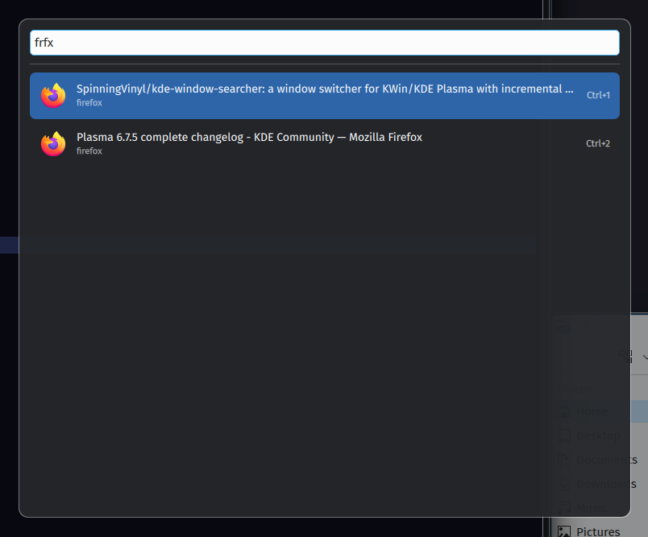

# Search Window Switcher

Window switcher for KWin with support for incremental search.



## Behaviour

- Windows are ordered by MRU, with the window that was active when the switcher opened appended at the end.
- The search field is focused immediately.
- Since v0.5.0, incremental search uses fuzzy string matching to make sure that `trminal` or `termnal` still matches `terminal`.
- Use Up/Down keys to move up and down the list (with wrap-around).
- Use Enter to activate the highlighted result.
- Use Escape or click outside the panel to cancel.
- Use Ctrl+1 ... Ctrl+0 to activate filtered results 1 ... 10.
- Alternatively, you can hover hover the mouse cursor over a row to select it and click to activate.
- A 30-second failsafe timeout automatically dismisses the effect to prevent situations when something steals focus from the searcher and makes it impossible to dismiss manually.

The default shortcut is `Meta+Alt+Space` (can be changed in KDE's keyboard shortcut settings).

## Install

```bash
kpackagetool6 --type KWin/Effect --install .
```

To upgrade an existing installation:

```bash
kpackagetool6 --type KWin/Effect --upgrade .
```

KWin may require the effect to be toggled off/on or, in some cases, a logout/login before a newly installed or upgraded QML effect is fully reloaded.
